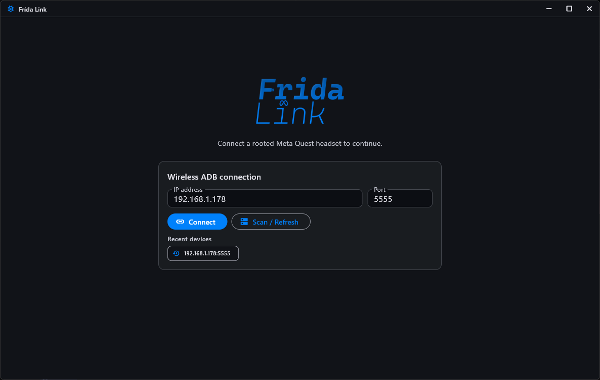
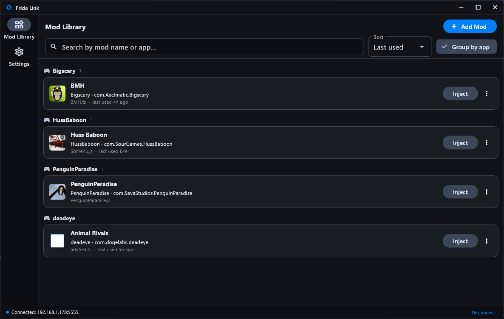
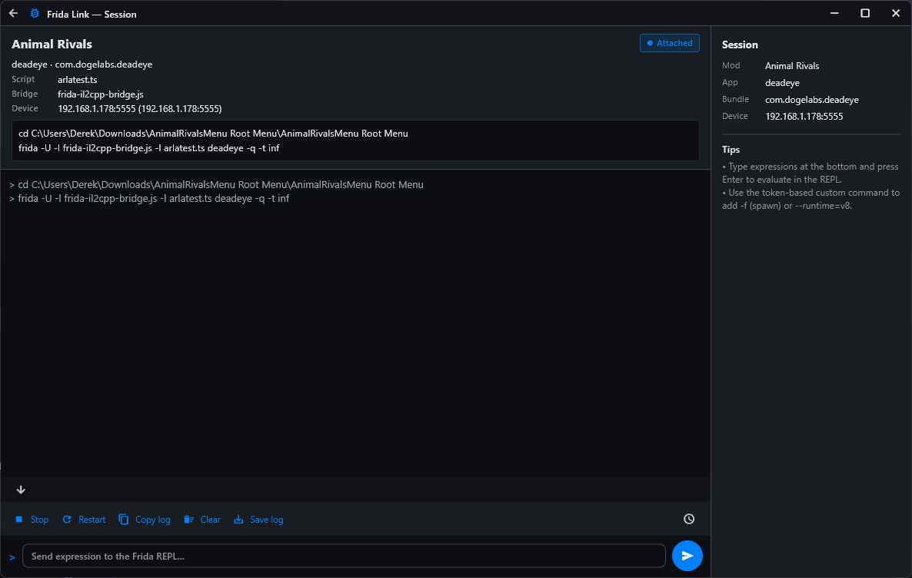
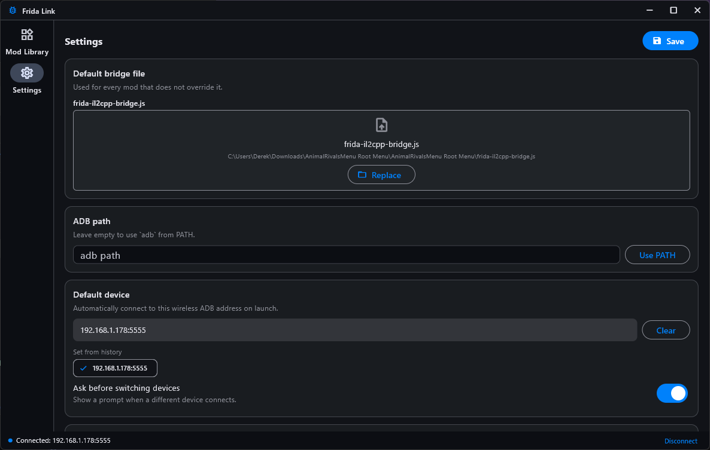
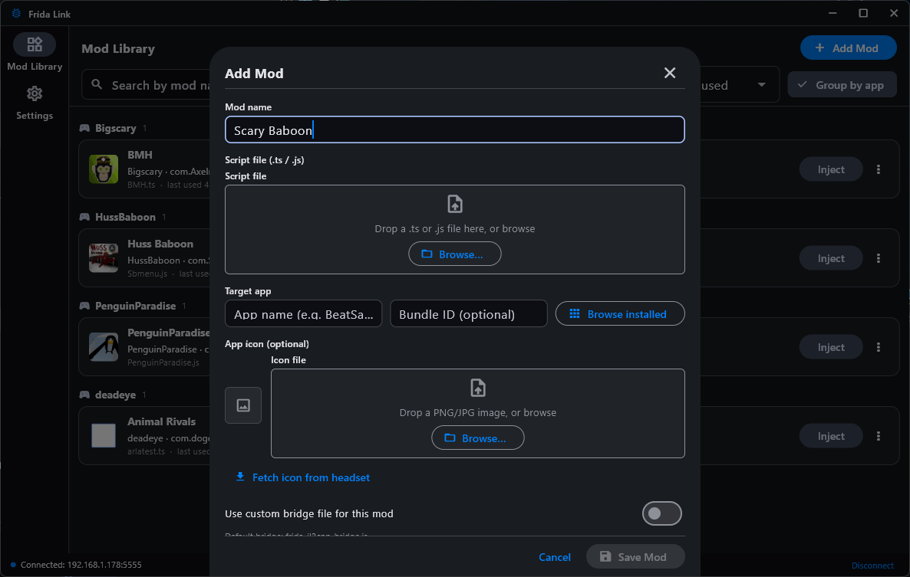

<p align="center">
  
</p>

<h1 align="center">Frida Link</h1>

<p align="center">
  <b>Inject Frida mods into rooted Meta Quest games over wireless ADB.</b><br>
  Windows desktop app · Flutter · x64
</p>

<p align="center">
  
</p>

---

**Frida Link** is a Windows desktop app for managing and injecting Frida mods
into rooted **Meta Quest** games over **wireless ADB**.
> This app **will not** root your headset or install frida-server for you.

## Features

- **One-click wireless connection** — guided 3-step pipeline:
  `Wireless ADB → root (su) check → frida-server`
- **Auto-connect** — remembers your default device and connects on launch
- **frida-server management** — detects if it isn't running and starts it in
  daemon mode (`frida-server -D`), and restarts any non-daemon instance so app
  spawning (`frida -f`) works
- **Mod library** — add, edit, duplicate, and delete mods; search, sort, and
  group by app
- **App icons** — each mod automatically shows its installed app's icon,
  pulled directly from the APK on the headset (biggest square launcher icon,
  even for obfuscated Unity builds), cached locally. Upload your own icon to
  override, or fall back to the placeholder
- **Injection console** — live mod output, timestamps, stop / restart,
  copy or save the log
- **Command preview** — see the exact `frida` command before injecting;
  override it per-mod with tokens (`{bridge}`, `{script}`, `{app}`,
  `{bundle_id}`, `{device}`)
- **Explorer integration** (optional) — "Open with Frida Link" on the right-click
  menu for `.ts` / `.js` files, which opens the Add Mod sheet pre-filled
- **Customizable** — dark mode, accent color picker, Material 2 toggle,
  adb path, default bridge file, bundle-id template

## Screenshots

| Mod library | Injection console |
| --- | --- |
|  |  |

| Settings | Add / edit mod |
| --- | --- |
|  |  |

## Requirements

### On your PC
- Windows 10/11 (x64)
- **adb** (Android platform-tools) — either on your `PATH` or set its path in
  Frida Link's Settings
- **frida** CLI tools on your `PATH` (the app runs `frida` commands)
- A **bridge script** for the game (e.g. `frida-il2cpp-bridge.js`)

### On your headset
- A **rooted** Meta Quest (Quest 2 / 3 / Pro)
- **Wireless ADB** enabled (Developer Mode; connect once over USB and run
  `adb tcpip 5555`, then unplug)
- **frida-server** installed at `/data/local/tmp/frida-server`

> You don't have to start `frida-server` yourself — Frida Link starts it in
> daemon mode automatically if it's not running.

## Getting started

1. Launch Frida Link.
2. Enter your headset's wireless ADB address, e.g. `192.168.1.50:5555`.
3. Let the pipeline run — connect, root check, frida-server check.
4. In **Settings**, set your default bridge file
   (`frida-il2cpp-bridge.js`).
5. **Add Mod** — pick your script (`.ts` / `.js`), a target app (name or
   bundle ID), and optionally an icon.
6. Hit **Inject** to launch the mod with a live console.

### Installing from the installer

The setup wizard offers:
- Install folder (pre-filled default)
- Install for **just you** (no admin) or **all users**
- Optional desktop shortcut
- Optional "Open with Frida Link" Explorer context menu for `.ts` / `.js`

## Building from source

```powershell
# Flutter Windows desktop build
flutter build windows --release

# Output:
# build\windows\x64\runner\Release\frida_link_v2.exe
```

To rebuild the installer (requires [Inno Setup 6](https://jrsoftware.org/isinfo.php)):

```powershell
ISCC.exe installer\frida_link_setup.iss
# Output:
# installer\dist\FridaLink-Setup-1.0.0.exe
```

## Settings reference

| Setting | Description |
| --- | --- |
| adb path | Path to `adb.exe` (empty = use `adb` from PATH) |
| Default bridge | Global `frida-il2cpp-bridge.js` used unless a mod overrides it |
| Command template | Default `frida` command; tokens: `{bridge}`, `{script}`, `{app}`, `{bundle_id}`, `{device}` |
| Bundle ID template | Builds a bundle ID from the app-name field, e.g. `com.{app}.{app}` |
| Default device | Wireless ADB address to auto-connect to on launch |
| Accent color | Material theme seed color (default Meta blue `#0081FB`) |
| Material 2 | Use the older Material 2 look instead of Material 3 |

## Troubleshooting

- **"Not rooted"** — the headset must actually grant `su`. Root it before
  connecting.
- **"frida-server not found"** — push the matching
  `frida-server` binary to `/data/local/tmp/frida-server` on the headset and
  `chmod +x` it.
- **Version mismatch** — your PC's `frida` and the headset's `frida-server`
  versions should match to avoid attach errors.
- **Can't reach the headset** — make sure both devices are on the same
  network and wireless ADB is enabled (`adb tcpip 5555`).
